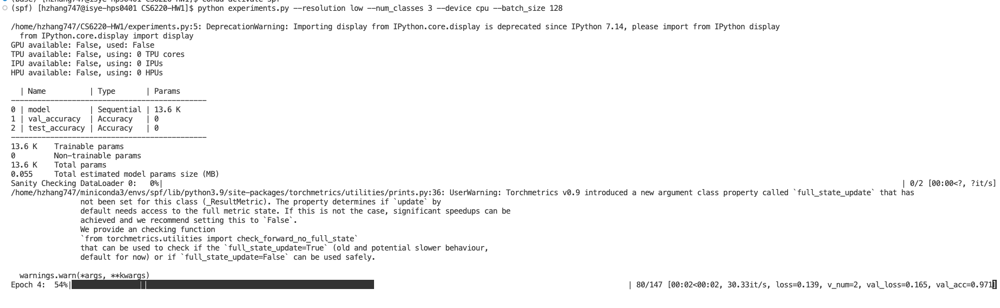

# CS6220-HW1

Training classification on MNIST dataset to compare the performance on CPU or CPU+GPU

## Deep Learning architechture

A simple MLP is used. The model consists 4 layers of FCNN. The first layer is the input layer which corresponds to the number of pixels of the image, the second and third layers are fixed of hidden dimension of 64, the last layer is the number of classes the models are trying to classify. 

## options
The model allows to run experiment with certain options

### resolution
high resolution corresponds to the originl MNIST data, which has 28 $\times$ 28 resolution image.

low resolution scales the MNIST data down to 12 $\times$ 12

Below shows the same image under two different resolutions

### num_classes
The model supports the original MNIST, which is 10 classes. And a subset of MNIST, which has 3 classes, 0,1,and 2.

### device

CPU or GPU

### batch size
any integer number of batch size

## Sample argument

`python3 experiments.py --resolution low --num_classes 3 --device gpu --batch_size 128`

it should produce something like this when it is running

## Deliverable
### input analysis
MNIST dataset with 7000 images. Each image has 28 $\times$ 28 pixels. Total size of compressed file is 66 MB on disk. 

A simple MLP is used. The model consists 4 layers of FCNN. The first layer is the input layer which corresponds to the number of pixels of the image, the second and third layers are fixed of hidden dimension of 64, the last layer is the number of classes the models are trying to classify. Batch size is a hyperparameter to test. Batchsize of 4 shows the best performance. So the results shown below are based on models trained with batchsize of 4. It runs 10 epoch on a learning rate of 1e-4. I use the same configuration for the tasks except changing the input and output dimention to corresponding dataset.

### output analysis
I am using a NVIDIA GeForce RTX 2080 Ti 7.5 to run the experiments.

| Resolution  | Number of Classes | Device| Training Time (s) |Test accuracy (%)|
| ----------- | ----------- |-------------------|---------------|-------------|
| High        | 3         |CPU   |348|99.36|
| High        | 3         |GPU  | 360|99.36|
| High | 10 |CPU | 825 |97.10|
|High | 10 |GPU | 805|97.18|
|Low | 3 | CPU | 327|99.27|
|Low |3 |GPU| 364 | 99.43|
|Low |10 |CPU|739 | 95.99|
|Low |10 | GPU | 812 |96.09|

The test time for all models is less than a second. 

* For the same task (same resolution of image and same number of classes), using CPU and GPU to train does not impact accuracy. 
* For the same task, the training time of CPU is shorter than GPU. But for complex task (10 classes, high resolution), GPU is faster than CPU.
* Training on low resolution image tends to train a little bit faster due to small number of learnable parameters, but the accuracy decreases. 
* As the number of classes increases, it is harder for classifier to make the correct decision. 

## references
The model mostly follows [this](https://pytorch-lightning.readthedocs.io/en/stable/notebooks/lightning_examples/mnist-hello-world.html) tutorial.
