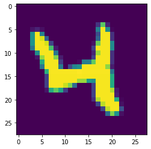
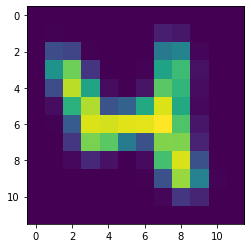
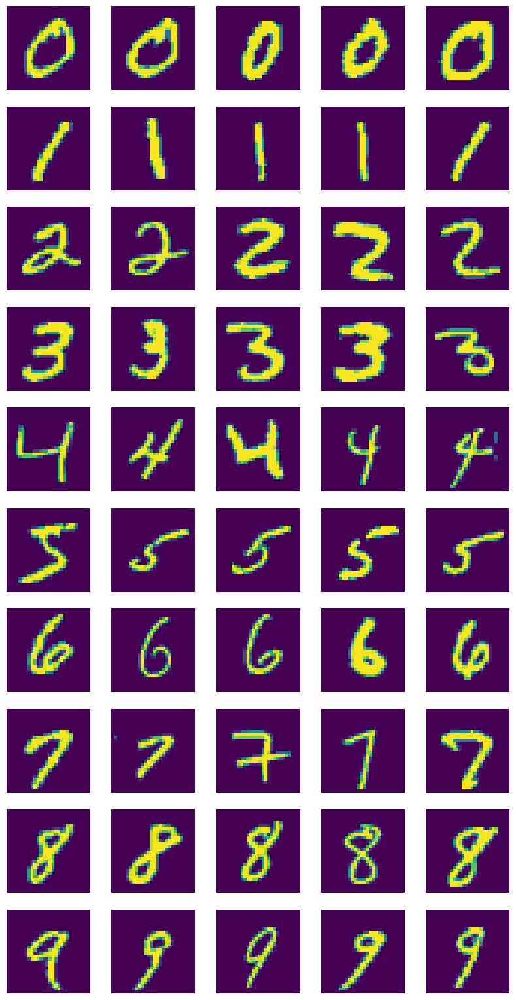

# CS6220-HW1

Training classification on MNIST dataset to compare the performance on CPU or CPU+GPU

## Deep Learning architechture

A simple MLP is used. The model consists 4 layers of FCNN. The first layer is the input layer which corresponds to the number of pixels of the image, the second and third layers are fixed of hidden dimension of 64, the last layer is the number of classes the models are trying to classify. 

## options
The model allows to run experiment with certain options

### resolution
high resolution corresponds to the originl MNIST data, which has 28 $\times$ 28 resolution image.

low resolution scales the MNIST data down to 12 $\times$ 12

Below shows the same image under two different resolutions

### num_classes
The model supports the original MNIST, which is 10 classes. And a subset of MNIST, which has 3 classes, 0,1,and 2.

### device

CPU or GPU

### batch size
any integer number of batch size

## Sample argument

`python3 experiments.py --resolution low --num_classes 3 --device gpu --batch_size 128`
## Deliverable
### input analysis
MNIST dataset with 7000 images. Each image has 28 $\times$ 28 pixels. Total size of compressed file is 66 MB on disk. 

## references
The model mostly follows [this](https://pytorch-lightning.readthedocs.io/en/stable/notebooks/lightning_examples/mnist-hello-world.html) tutorial.
